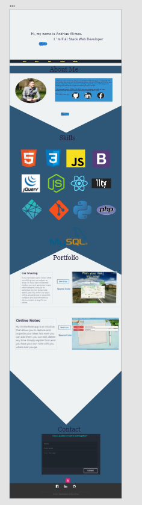
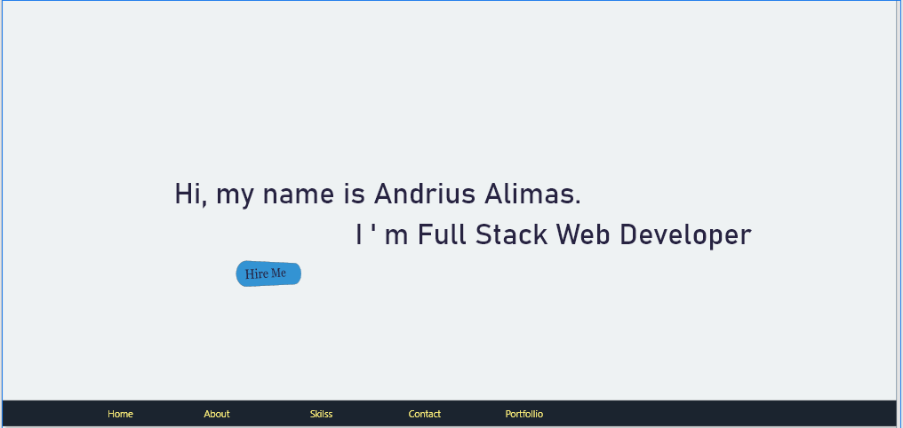
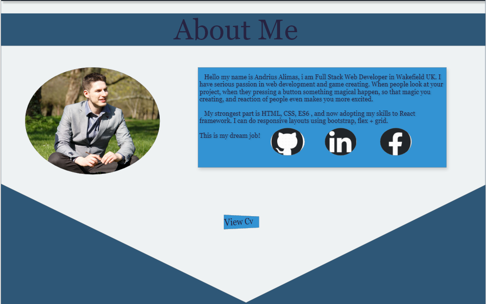
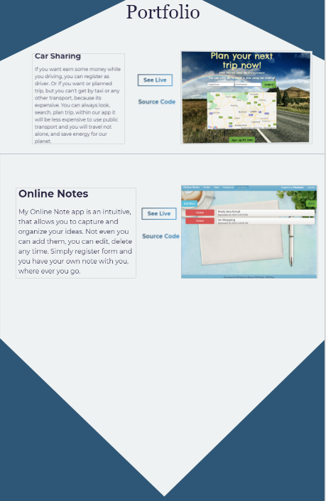
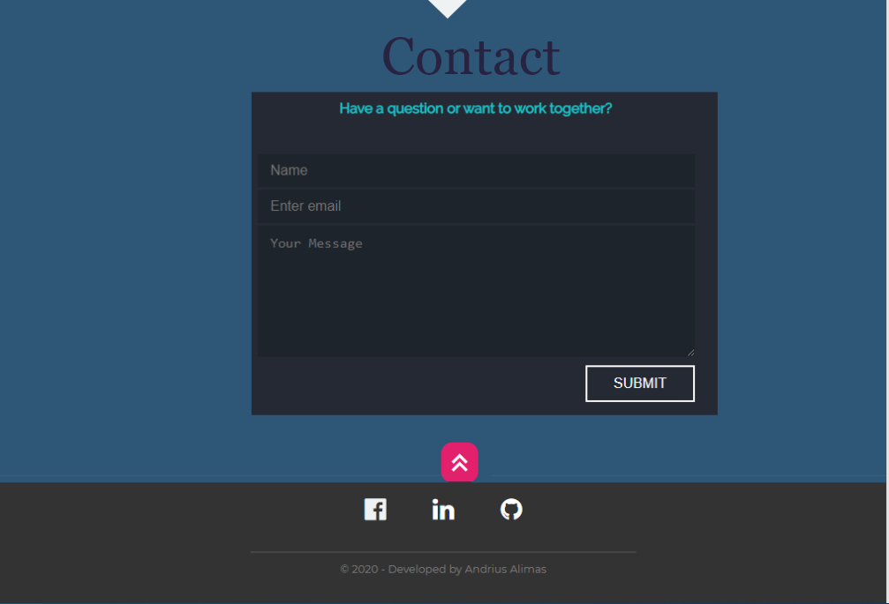

# MyWebDeveloperPortfolio

This is my main web developer portfolio. I hope you will enjoy and will contact me if you need me.

## Technologies:

- **HTML**
- **CSS**
- **Media queries**
- **JS**
- **Git**
- **Command Lines**
- **WireFrame**

## Project Goals:

## `For this project, you will build a personal portfolio site, a static website where you can share the projects that you build in this Path. Typically, a portfolio website will have a main page that features different projects that you’ve built and another page that contains contact information, in case someone wants to reach out to you. Occasionally, there are additional pages for each project, detailing the technology used.`

## Project Objectives:

1. **Build a website using HTML, CSS**
2. **Add at least one interactive feature using JavaScript**
3. **Use Git version control**
4. **Use the command line and file navigation**
5. **Develop locally on your computer**
6. **Deploy your site to the web using GitHub Pages**
7. **OPTIONAL: Buy a custom domain name and have it point to your GitHub Pages website**

---

### This is my WireFrame:

 

Text color using: #27341
Body background color: #EEF2F3

### Contact

**Author** - Andrius Alimas

**Email** - alimaswebdeveloper@gmail.com
